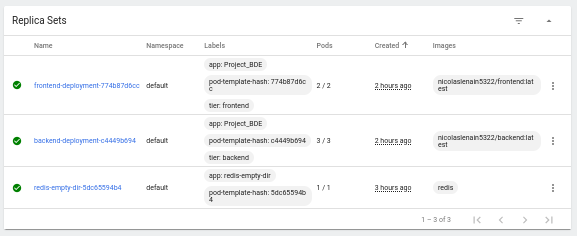

# Project_BDE

The objective of our project is the installation of k3s on Raspberry Pi and the deployment of a data application.

- Introduction
- Installation
- Deployement
- Problems encountered

----

## 1. Introduction

----

To do this project, we planned to use a Raspberry.
But due to some issues detailed in "Problems encountered" part, we finally used an Ubuntu (20.04 LTS Desktop) image on Virtual Box with 4GB RAM & 32Go storage.

So, in this project, we will deploy this cluster architecture:

Ingress is an API object that manages external access to the services in a cluster and provide load balancing between nodes.

The frontend is a NodeJS web application. We re-use school project on pollution. The original frontend use cloud storage (Dynamodb), so we modify to request our localhost backend.

The backend is also a NodeJS API application with Redis to store data. 

It's a distributed architecture where we replicate our frontend into 2 pods, and our backend into 3 pods.
These pods are distributed inside 3 nodes to insure availability and consistency of our application.

## 2. Installation

----

To use k3s, we used k3d, a tool that allow us to create a Kubernetes cluster on Docker containers.
So we had to download Docker and kubectl before k3d.

## Docker

Docker allow us to create and run containers. We will use it to push/pull our backend and frontend images in the docker Hub. 

`sudo apt-get update`

`sudo apt-get install \
    ca-certificates \
    curl \
    gnupg \
    lsb-release`

`curl -fsSL https://download.docker.com/linux/ubuntu/gpg | sudo gpg --dearmor -o /usr/share/keyrings/docker-archive-keyring.gpg`

`echo \
  "deb [arch=$(dpkg --print-architecture) signed-by=/usr/share/keyrings/docker-archive-keyring.gpg] https://download.docker.com/linux/ubuntu \
  $(lsb_release -cs) stable" | sudo tee /etc/apt/sources.list.d/docker.list > /dev/null`

`sudo apt-get update`

`sudo apt-get install docker-ce docker-ce-cli containerd.io`

`sudo apt-get install docker-compose`

### Kubectl

Kubectl is the Kubernetes command-line tool. It allows us to run commands against Kubernetes clusters, deploy applications, inspect and manage cluster resources, and view logs. We will use kubectl to deploys our applications.

We used snap to install kubectl:

`sudo apt update`

`sudo apt install snapd`

`sudo snap install kubectl --classic`

### K3d

K3d (https://k3d.io/v5.2.2/) is a community driven project wich allow to easily create single- and multi-node k3s clusters in docker, e.g. for local development on Kubernetes. We will use K3d to create our cluster.

`wget: wget -q -O - https://raw.githubusercontent.com/rancher/k3d/main/install.sh | bash`

## 3. Deployement

----
We can now create a cluster with one server and 2 agents:

`k3d cluster create a --agents 2 --port "8080:80@loadbalancer"`

We can look at the created nodes:

`kubectl get nodes`

Then we start the application with this command:

`docker-compose up`

Docker Compose will use the different Dockerfile in the backend and frontend directories.

Now, we need to build and push our images. To do so, we need to use docker hub, the docker platform to manage images. We first need to log:

`docker login -u <your_docker_hub_username>`

At the password prompt, enter the personal access token.

We can now start to building docker images.

For the backend:

`docker build -t backend .`

`docker tag backend <your_docker_hub_username>/backend`

`docker push <your_docker_hub_username>/backend`

For the frontend:

`docker build -t frontend -f Dockerfile .`

`docker tag frontend <your_docker_hub_username>/frontend`

`docker push <your_docker_hub_username>/frontend`

We have to deploy the database to our cluster/

To do it so, we create the persistent volume with this command:

`kubectl apply -f backend/k8s/volumes/persistVolume.yaml`

Then we create the persistent volume claim:

`kubectl apply -f backend/k8s/volumes/persistVolumeClaim.yaml`

We apply this deployment for the database:

`kubectl apply -f backend/k8s/emptyDir/deployment.yml`

And the service:

`kubectl apply -f backend/k8s/emptyDir/service.yml`

We now have to deal with the backend. To do it so, we use a ConfigMap:

`kubectl apply -f backend/backend-config.yaml`

We then create a Secret:

`kubectl create secret generic backend-secrets --from-file=backend_secret=secrets/backend_secret.txt`

We then do the deployment for the backend:

`kubectl apply -f k8s/backend-deployment.yaml`

And for the service:

`kubectl apply -f backend/backend-service.yaml`

After that, we do a similar process for the frontend deployment:

`kubectl apply -f frontend/frontend-deployment.yaml`

And for the service:

`kubectl apply -f frontend/frontend-service.yaml`

We can now observe the list of deployments:

`kubectl get deployments`

And the list of services:

`kubectl get services`

We apply the ingress controller:

`kubectl apply -f ingress.yaml`

We can finally acces to our application:

`localhost:8080`

We can access to Kubernetes Dashboard. To do so we need to apply this:

`kubectl apply -f https://raw.githubusercontent.com/kubernetes/dashboard/v2.1.0/aio/deploy/recommended.yaml`
`

And to launch this:

`kubectl proxy`

We can acces to the dashboard with this link:

`http://localhost:8001/api/v1/namespaces/kube-system/services/https:kubernetes-dashboard:/proxy/`

But it will ask a token. To access to it, we need to create the dashboard service account:

`kubectl create serviceaccount dashboard-admin-sa`

And then to bind the service to the cluster-admin role:

`kubectl create clusterrolebinding dashboard-admin-sa 
--clusterrole=cluster-admin --serviceaccount=default:dashboard-admin-sa`

We then list the secrets:

`kubectl get secrets`

And we display the access token we need to authenticate:

`kubectl describe secret <your-dashboard-admin-sa-token>`
    
We can now access to the kubernetes dashboard and different metrics:

    
We can see the deployments:
    

We can see our different pods:
    

    
We can observe the information about replica:
    

    
## 4. Problems encountered
    
### Docker version on Raspbian

We tried on Raspberry Pi 3B+ (1GB RAM & 16Go storage) on the Raspberry PI OS, known as Raspbian. But k3d required an unavaible version of Docker on Raspbian. The last available docker version on Raspbian is 19.03, when k3d required a version >20.

### Ubuntu and Pi 3B+ model limits

Then we installed Ubuntu 20.04 LTS on the Raspberry. We managed to install all packages (docker, kubectl, k3d), but we got limited by the RAM when we try to create the cluster with k3d. 
    
### Ubuntu on VM storage.

Then, we install Ubuntu image on Virtual Box with 4GB RAM & 10Go storage. But we got limited by the disk storage but our nodes were "under disk pressure" and were unable to run.
We advise to allow 32Go disk space to be more than enough. At the end of the implementation, we reached 24Go of used space.
    
Despite that k3s is smaller version of Kubernetes that is better suited to devices with less capacity. We would need more raspberry models (to install one node per raspberry) or a better model like Raspberry 4B (to handle the whole cluster memory charge).
